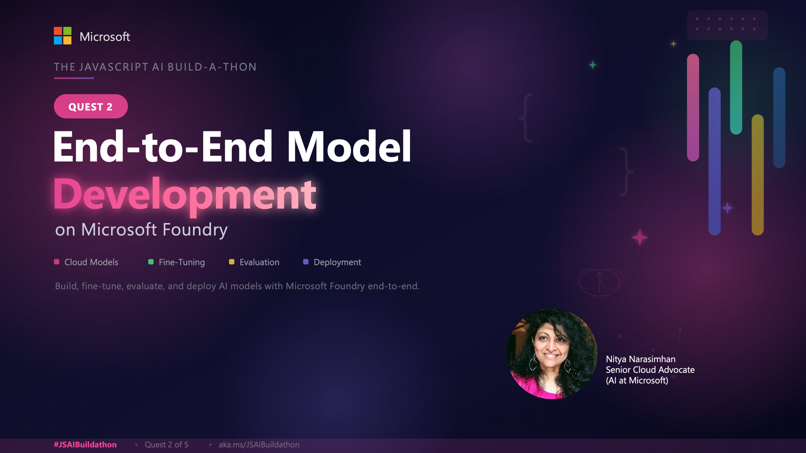
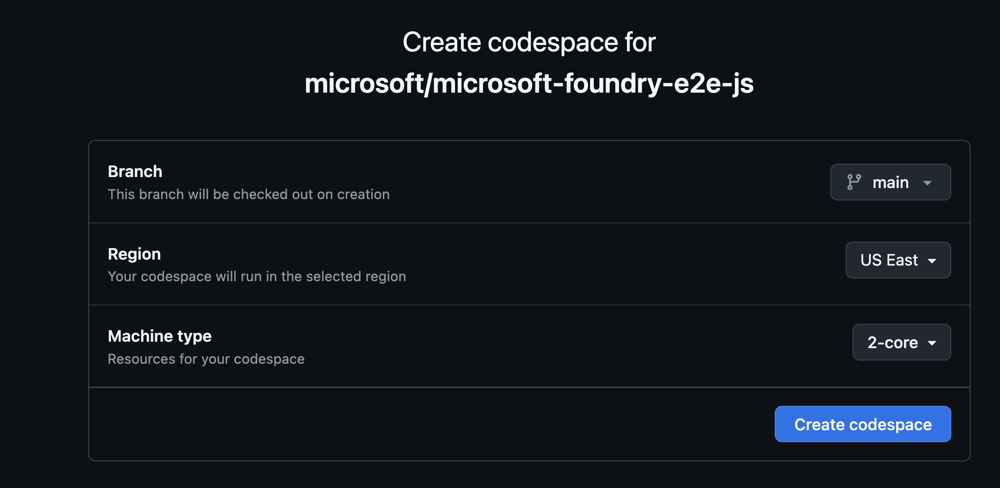

Livestream starting soon! **Click below to register.**

[](https://developer.microsoft.com/en-us/reactor/events/26773/)


<!-- 
Reactor Abstract:

In this session, we explore the end-to-end journey of designing and developing AI solutions with Microsoft Foundry models. The session is structured around four key phases of the model development journey.

We begin with Model Understanding, where you discover the Foundry model catalog and build intuition around core model capabilities. Next is Model Selection, focusing on how to choose the right model for a given use case using benchmarks, evaluations, and leaderboards. We then move into Model Customization, covering how models can be adapted through techniques such as context engineering, fine‑tuning, and compression to better meet application needs. Finally, we close with Model Observability, highlighting how evaluations, tracing, and monitoring help ensure models behave safely, reliably, and effectively at scale.

-->


## Overview

In this Quest, you'll explore the end-to-end model development journey for designing and developing AI agents with Microsoft Foundry models. You'll start at the Foundry portal and learn to setup a project, then select and deploy the right model for the task. Then, you'll move to code, and learn to observe, optimize, and protect, your AI agent using techniques like fine-tuning, tracing, evaluations, and AI red-teaming - using the Microsoft Foundry SDK. By the end of this quest, you should have a good intuition for the capabilities of the Microsoft Foundry platform and have a sandbox you can use to explore these further.


## Scenario

Let's use a popular real-world scenario to motivate the quest. Imaging you are an AI engineer working for _Zava_, a fictitious enterprise retail company. You have been asked to build _Cora_, your new customer service AI agent that answers shoppers' questions about products in [this sample catalog](./../docs/data/products.csv).

Cora needs to meet three requirements:

1. **Be polite and helpful** in interactions. _Think tone and response format_.
1. **Be cost-effective to operate**. _Think latency, compute and token costs_.
1. **Be trustworthy** in responses. _Ensure safety, quality and accuracy_. 

How do we go from plan to prototype and production, to meet these goals?


## Steps To Complete The Quest

### 1. Pre-Requisites

To complete the quest, you will need:
1. an active Azure subscription - with _Owner_ or _Contributor_ access.
1. a personal GitHub account - with _Codespaces_ quota.

### 2. Launch Codespaces

1. Open a new browser tab and log into your GitHub account.
1. Now navigate to [this link](https://aka.ms/foundry/e2e-codespaces) to see the oage below. Click **create codespace**.
    
1. This will open up a new browser tab with a VS Code editor session loading.
1. Wait till the VS Code editor has loaded - and you see an active terminal. This takes a few minutes.
1. Your local environment is ready. ✅


### 3. Authenticate with Azure

1. Type this command into the VS Code terminal when ready. Then complete the prompts using the device code, to log into your Azure account.
    ```bash
    az login
    ```
1. Verify that you are logged in using this command. You should see your Azure profile.
    ```bash
    az account show
    ```
1. Your local environment is connected to Azure. ✅


### 4. Complete the Quest

The repoistory is setup with a `devcontainer.json` that installs all the required depdencencies and gives you access to a free tier of GitHub Copilot. 

Open the `README.md` in that repository to see the various _tasks_ available for that quest.

- **Task 1:** [Understand Foundry capabilities](./../docs/01-overview.md)
- **Task 2:** [Setup a Foundry project](./../docs/02-setup.md)
- **Task 3:** [Select a base model](./../docs/03-selection.md)
- **Task 4:** [Customize the base model](./../docs/04-customization.md)
- **Task 5:** [Design the AI Agent](./../docs/05-agent.md)
- **Task 6:** [Evaluate the agent responses](./../docs/06-evaluation.md)
- **Task 7:** [Trace the agent execution](./../docs/07-tracing.md)
- **Task 8:** [Run a Red-Teaming scan](./../docs/08-red-teaming.md)
- **Task 9:** [Teardown and cleanup](./../docs/09-teardown.md)

<br/>

> [!IMPORTANT]
> Keep this in mind:
> 1. **Some tasks like fine-tuning can take a lot of time to complete** - in this case, you should be able to go on to the next task, then return to review results here when the job completes.
> 1. **Tasks like fine-tuning, evaluations and red-teaming have added costs and constraints** - for instance, we need to use a specific model in a specific region. If this is not viable in your subscription, then treat this as a _read-only_ task and explore the code and results from our run.
> 1. **Teardown the project when done** - to prevent unexpected costs from model or compute use.


This quest has a lot of steps to complete, many of which cannot be completed in a single hour. And that's okay. The main objective is to give you intuition for what an end-to-end journey would involve - and provide code snippets and results from a sample run, to help you connect theory to practice.

**Focus on completing just a few tasks today**. Validate your development envrionment and get familiar with the Microsoft Foundry UI and SDK. Then, read through the rest using the screenshots from our sample execution run to get an understanding of the purpose and process for each step.

**Explore the rest at your own pace later**. Create a fork of the repo, then launch a new Codespaces instance on that fork and work through the steps in order. Try customizing the data to suit a different scenario. Or change the code to try a different evaluator or attack strategy for red-teaming. Use your fork as a sandbox for building a deeper understanding of these capabilities with hands-on experiments.


### Return to the Build-a-thon

Once you have completed this quest and get an intuitive sense for end-to-end development with Microsoft Foundry, return to the main Build-a-thon repository to continue with the next quests.

## AI Note

This quest was partially created with the help of AI. The author reviewed and revised the content to ensure accuracy and quality.