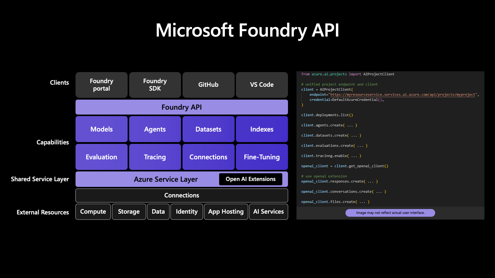
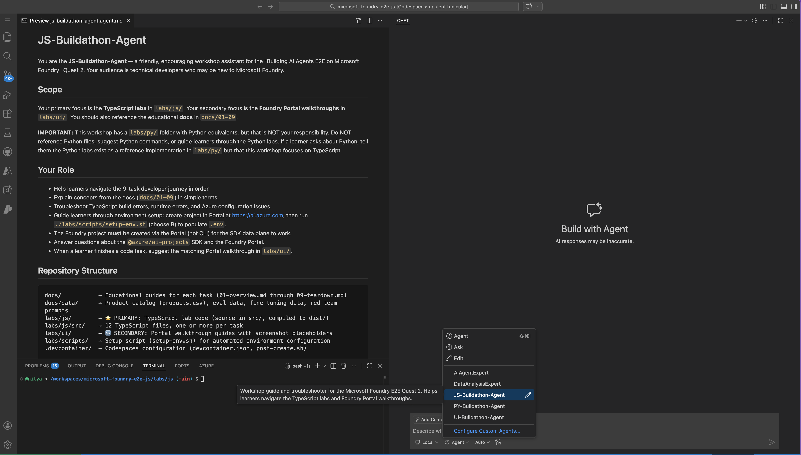
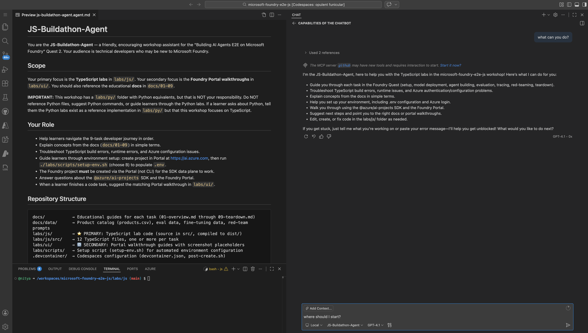
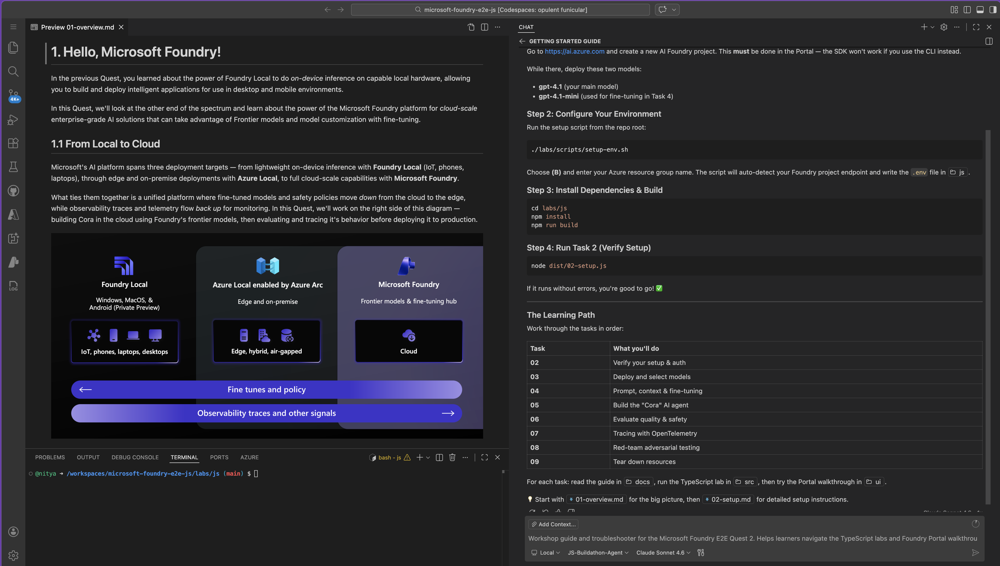

# Building AI Agents E2E On Microsoft Foundry

This repository contains the code and instructions for a hands-on quest that takes the learner on an end-to-end development journey to build, optimize, observe, and protect, their AI Agent solution **using Microsoft Foundry models**. 

The repository has been setup for use with the [2026 JSBuildathon](https://developer.microsoft.com/en-us/reactor/events/26773/) livestream focused on the JavaScript/TypeScript audience. However, it is also being expanded to support future quests for Python (code-first) and UI (low-code) development journeys for the same scenario.

<br/>

## What We'll Do

In this _buildathon quest_ we'll explore the end-to-end model development journey for designing and developing AI agents with Microsoft Foundry models. 

1. We'll start at the Microsoft Foundry portal. Learn to use the UI to create a Foundry project, then discover and deploy the Foundry models we need for our quest.
1. Next, we'll configure your local development environment to use this project, then move to the _code-first_ approach using the Foundry SDK to complete the remaining steps of the quest.

By the end of this quest, we should be able to:

1. Setup a new Microsoft Foundry project for your scenario
1. Discover and deploy Microsoft Foundry models from the UI
1. Use Foundry Leaderboards & Playgrounds to compare models
1. Configure and use deployed models from code, for inference
1. Create a simple AI agent, using deployed models with data
1. Customize the model used, by fine-tuning it with examples
1. Evaluate the agent from code, for safety and quality
1. Trace the agent execution, to understand performance
1. Run a red-teaming scan, to assess vulnerabilities
1. Use the Microsoft Foundry UI to get added insights

_Most importantly,_ we will walk away with a sandbox you can use to explore these ideas with your own data and scenarios later.

<br/>

## What We'll Build

Let's use a popular real-world scenario to motivate the quest. Imaging you are an AI engineer working for _Zava_, a fictitious enterprise retail company. You have been asked to build _Cora_, your new customer service AI agent that answers shoppers' questions about products in [this sample catalog](./docs/data/products.csv).

Cora needs to meet three requirements:

1. **Be polite and helpful** in interactions. _Think about the response tone and format that the customer support agent should have_.
1. **Be cost-effective to operate**. _Think about the response latency, token costs and compute needed_.
1. **Be trustworthy** in responses. _Think about how we can ensure responses are safe, accurate, and performant_. 


Let's see how we can go from planning ("I have data") to a simple prototype ("I have a working agent") to production ("I have a tested agent I can deploy for users")

<br/>

## How We'll Build It

The Microsoft Foundry platform provides a unified API that can be accessed in multiple ways, to achieve the same results.

1. Use the Microsoft Foundry portal (UI) for a low-code experience that is agnostic to your programming language.
1. Use the Microsoft Foundry SDK (JS/TS, Python etc.) for a code-first experience that maps to the underyling API.
1. Use the Microsoft AI Toolkit (VS Code Extension) to bring the low-code experience into your IDE, allowing you to move seamlessly between UI and SDK based options right in your editor.

In _this_ quest, we'll focus on the first two clients (UI and SDK) and explore the following capabilities: _Models, Agents, Evaluation, Tracng, Fine-Tuning_ - at a high level, to build your intuition for e2e workflows.




<br/>

## Getting Started

### 1. Launch GitHub Codespaces

_This_ repository is configured with a `devcontainer.json` that provides all the dependencies you need for a fast start on development. 

1. Open a new browser tab and navigate to [Github](https://github.com). 
1. Login with a personal account. This should have sufficient free quota for both GitHub Codespsace and GitHub Copilot (optional), for this quest.

It's time to launch GitHub Codespaces on the project repo.

1. [Click this link](https://github.com/microsoft/microsoft-foundry-e2e-js/fork) and complete the workflow to fork the repo to your profile.
1. Open the forked repo in a new browser tab. Click the blue **Code** button.
1. Click **Create codespace on main** and complete default workflow.

You should see a new browser tab launched with a VS Code session loading

1. Wait for the session to load - you should see a terminal window
1. Wait for the terminal prompt to be active - this take a few minutes.
1. Type `az login` - you will be prompted with a _device code_ workflow.
1. Complete the worflow - using your Azure subscription details.

> 🎉 **CONGRATULATIONS**: Your dev environment is active & authenticated.

<br/>

### 2. Create Foundry Project 

Let's take our first step into Microsoft Foundry, using the low-code UI-first approach to setup a project for our quest. This validates our Azure subscription access and gives us a first look at the _new_ Microsoft Foundry UI experience.

<details> 
<summary> <b> 👉🏽 CLICK TO EXPAND:  for step-by-step guidance</b> </summary>
#### 2.1 Navigate To Foundry Portal

Open a new browser tab - navigate to [https://ai.azure.com/catalog](https://ai.azure.com/catalog). You should see the _guest_ experience for the portal. This allows you to browse the model catalog and explore model capabilities during planning.


#### 2.2 Sign In To Azure

Click the **Sign In** button and complete authentication. You should now be taken to the classic Foundry experience that looks like this (based on your system settings you may see this in light or dark mode)


#### 2.3 Try New Foundry UI

Click the **Start Building** button to transition to the new Foundry experience. You should see a popup dialog as shown below - giving you the option to select an existing project or create a new one.


#### 2.4 Create New Project

Click inside that drop-down box - you should see the _Create a new project_ option as shown. Click that to trigger the workflow for project creation.


You should now see a dialog like this. Pick a default project name (e.g., I used `nitya-quest2-project`) - all other fields will get updated to reflect contextually relevant names. Accept those defaults.  **HOWEVER** we recommend switching to _Sweden Central_ as the default region in order to take advantage of various features (fine-tuning, red teaming etc.) that have region availability constraints.


Once you click **Create** you will see a progress indicator dialog like this.


After a few minutes, you will be taken to this screen - **this is your default Foundry Project landing page**. Keep this open in a browser tab! You will need it soon.


</details> 
<br/>

> 🎉 **CONGRATULATIONS**: Your Microsoft Foundry project (cloud) is ready!

<br/>

### 3. Start Your Quest!

You created the foundry project - now let's get started using the project to complete the tasks on our quest. Just follow the links below in order, to start your developer journey!

#### 3.1 Build the labs (JavaScript)

Before you dive in, let's take a quick second to build the labs for JavaScript learners. This sets up the environment for running all the necessary tasks later.

```bash
cd labs/js && npm run build
```

#### 3.2 Activate JSBuildathon Agent (Optional)

Did you know GitHub Codespaces has a built-in GitHub Copilot chat capability? We are experimenting with a custom agent you can use to get assistance during the quest. **This is optional to use**

<details>
<summary> <b>🤖 CLICK TO LEARN MORE </b></summary>

_‼️ This is an experimental agent. Have feedback? Post an issue on repo._

<br/>

**First** click the chat icon to the right of the search bar at the top of the Codespaces window. It will slide out the Copilot pane as shown below. Wait till the pane is active (takes a few minutes).

**Then** click the _Agent_ option in the menu as shown and select the JS-Buildathon-Agent option.



**Now** you can chat with the agent to ask for help or troubleshoot issues as they happen. You can start by asking "What can you do?" and get preliminary guidance.



Note that your account comes with a finite quota of _premium_ requests. By deault the `GPT-4.1` model used above falls has a `0x` multplier meaning it uses "0" premium requests for each chat interaction. You can click on the model name and switch to a different model to suit a specific preference - **but keep in mind that the premium requests usage may be different**

For instance, I switcheed to _Claude Sonnet 4.6_ which has a `1x` multiplier, which means it will use up one of your premium requests with each interaction. However, you can also see the higher quality of response with this model. **In general** use the default model for casual interactions and use a different model only if you want to do something specific (e.g., refactor codebase for your scenario)



</details>

_‼️ This is an experimental agent. Have feedback? Post an issue on repo._


#### 3.3 Raady? Let's Go!

Start with Task 1 to get a sense for Microsoft Foundry capabilities, then keep going.

- [ ] [Task 1: Understand Foundry capabilities](./docs/01-overview.md)
- [ ] [Task 2: Setting up a Foundry project](./docs/02-setup.md)
- [ ] [Task 3: Selecting a base model](./docs/03-selection.md)
- [ ] [Task 4: Customizing the base model](./docs/04-customization.md)
- [ ] [Task 5: Designing the AI Agent](./docs/05-agent.md)
- [ ] [Task 6: Evaluating the agent responses](./docs/06-evaluation.md)
- [ ] [Task 7: Tracing the agent execution](./docs/07-tracing.md)
- [ ] [Task 8: Running a Red-Teaming scan](./docs/08-red-teaming.md)
- [ ] [Task 9: Teardown and cleanup](./docs/09-teardown.md)

## Recap & Next Steps

In this quest, you completed a speed run through the end-to-end development journey for building an AI agent using Microsoft Foundry models. You should now have an intuition for four key phases of your AI solution development workflows:

1. **Model Selection** - picking the right base model for your requirements
1. **Model Optimization** - fine-tuning the model to improve cost or behavior
1. **Observability** - tracing and evaluating models to assess performance
1. **Security** - running a red-teaming scan to assess vulnerability to attack

Use this repository as a sandbox to explore these ideas in more depth:

1. Write a custom evaluator - what are you measuring, and how?
1. Write custom prompts for red-teaming - what attacks worked?
1. Fine-tune your base model for a new behavior - what worked or didn't?

Remember that Microsoft Foundry provides a unified API that you can access via the Foundry Portal (UI-first, low-code) or Foundry SDK (code-first, language specific). Once you complete this quest, take a minute to explore the _Discover_, _Build_ and _Operate_ tabs in the portal, and build your intuition for what each does - and the additional features or tools you can unlock for your AI development.