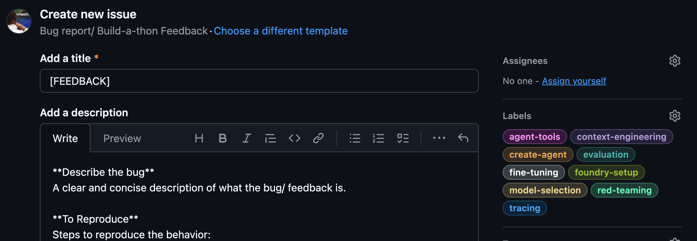

# Building AI Agents E2E On Microsoft Foundry

_The repository was setup for the [2026 JSBuildathon](https://aka.ms/JSAIBuildathon) and showcases the Microsoft Foundry UI and SDK for JS/TS developers. These are evolving rapidly, so you may encounter some breaking changes. If you do, please [file an issue](https://github.com/microsoft/microsoft-foundry-e2e-js/issues/new) and let us know._

> [!IMPORTANT]
> After the livestream we will make a step-by-step walkthrough of the quest available that you can use to review the concepts without actually executing the tasks. This will give you an option to get familiar with the end-to-end development journey without having to use your Azure subscription (incur costs) if useful.

 

## What We'll Do

In a previous quest, you explored [Foundry Local](https://www.foundrylocal.ai/) and learned to deploy and explore large language models for **on-device** AI development.

In this quest, we move from local device to the cloud, and explore the end-to-end development journey for building & deploying AI agents using [Microsoft Foundry models](https://ai.azure.com/catalog)

- We'll start our journey at the new [Microsoft Foundry portal](https://ai.azure.com) - and use a low-code (UI-first) approach to setting up our Foundry project and deploy required models.
- Then, we'll move to our development environment - and use the _latest_ [Microsoft Foundry SDK](https://learn.microsoft.com/en-us/azure/foundry/quickstarts/get-started-code?tabs=typescript) to create agents, customize models, and evaluate our solutions for quality, safety and performance.

By completing the quest, you will learn how to:

1. Setup a new Microsoft Foundry project from scratch
1. Discover & compare Microsoft Foundry models in the UI
1. Deploy & use Microsoft Foundry models for inference
1. Create & test a simple AI agent with models and data
1. Customize the model with supervised fine-tuning
1. Evaluate your agent for quality, safety & performance
1. Assess vulnerability to attacks with red-teaming
1. Use Microsoft Foundry portal to monitor for insights

Most importantly, you will walk away with a sandbox you can use to continue exploring the platform on your own, with your own data or scenarios in mind.

 

## What We'll Build

It helps to have a real-world scenario in mind as you walk through the quest. Imagine that you are an AI engineer working for _Zava_, a fictitious enterprise retail company selling products to DIY enthusiasts.

You have been asked to build _Cora_, a customer service AI agent that answers shoppers' questions about products in [this sample catalog](./docs/data/products.csv). Project Cora has three requirements:

1. **Be polite and helpful** in interactions. _Think about the response tone and format that the customer support agent should have_.
1. **Be cost-effective to operate**. _Think about system performance, and optimize for response latency, token costs and compute_.
1. **Be trustworthy** in responses. _Think about user experience, and ensuring our responses are safe, accurate, and performant_. 

You need to go from _planning_ ("I have product data") to _prototype_ ("I have a working agent!") to _production_ ("It's ready for real users!"). So, where do we start?

 

## How We'll Build It

The Microsoft Foundry platform provides all the tools and capabilities (e.g., _Models, Agents, Evaluation, Tracing, Fine-Tuning_) that you need to build this solution end-to-end. And, it provides a _unified API_ as shown below, allowing you to access these features in multiple ways:

1. **Foundry portal** - for a UI-first low-code solution in the browser.
1. **Foundry SDK** - for a code-first solution using your favorite IDE.
1. **AI Toolkit** - for a VS Code-first experience that combines both.

In this quest we focus on (1) and (2) - and you'll get to explore (3) in a future quest in this series.

 

## Getting Started

> [!NOTE]
>
> The Foundry SDK is under active development. 
>
> If you encounter any blockers, unclear steps, or have suggestions to improve the developer experience, please open an issue using the [provided issue template](https://github.com/microsoft/microsoft-foundry-e2e-js/issues/new/choose) - *Bug report/ Build-a-thon Feedback*. Make sure to **apply the label** that matches the step you were on when the issue occurred.
>
> 

_By now you should have launched the GitHub Codespaces session on this repo. If you have NOT done this, click below to expand the section for instructions_.

 <b> 👉🏽 INSTRUCTIONS TO LAUNCH GITHUB CODESPACES!</b>
 

**First, let's fork the repo**.

1. Open a new browser tab to [Github](https://github.com) - and login.
1. [Use this link](https://github.com/microsoft/microsoft-foundry-e2e-js/fork) - and fork the repo to your profile.
1. Open this forked repo in a new browser tab

**Now, launch GitHub Codespaces**.

1. Click the blue **Code** button - then switch to the **Codespaces** tab.
1. Click **Create codespace** - this opens a new browser tab.
1. You will see a VS Code editor - wait till it loads completely.

 

You can now visit the [SETUP.md](./SETUP.md) page to authenticate with Azure and setup a Microsoft Foundry project - then complete coding tasks with the Microsoft Foundry SDK.

 

## Recap & Next Steps

In this quest, you completed a speed run through the end-to-end development journey for building an AI agent using Microsoft Foundry models. You should now have an intuition for four key phases of your AI solution development workflows:

1. **Model Selection** - picking the right base model for your requirements
1. **Model Optimization** - fine-tuning the model to improve cost or behavior
1. **Observability** - tracing and evaluating models to assess performance
1. **Security** - running a red-teaming scan to assess vulnerability to attack

Use this repository as a sandbox to explore these ideas in more depth:

1. Write a custom evaluator - what are you measuring, and how?
1. Write custom prompts for red-teaming - what attacks worked?
1. Fine-tune your base model for a new behavior - what worked or didn't?

Remember that Microsoft Foundry provides a unified API that you can access via the Foundry Portal (UI-first, low-code) or Foundry SDK (code-first, language specific). Once you complete this quest, take a minute to explore the _Discover_, _Build_ and _Operate_ tabs in the portal, and build your intuition for what each does - and the additional features or tools you can unlock for your AI development.

## Return to the Build-a-thon

Once you have completed this quest and get an intuitive sense for end-to-end development with Microsoft Foundry, [return to the main Build-a-thon repository](https://github.com/Azure-Samples/JavaScript-AI-Buildathon) to continue with the next quests.