# Getting Started

_The repository was setup for the [2026 JSBuildathon](https://developer.microsoft.com/en-us/reactor/events/26773/) and showcases the Microsoft Foundry UI and SDK for JS/TS developers. These are evolving rapidly, so you may encounter some breaking changes. If you do, please [file an issue](https://github.com/microsoft/microsoft-foundry-e2e-js/issues/new) and let us know._

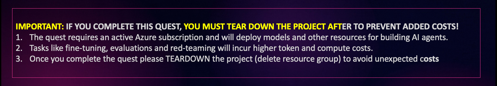

> [!IMPORTANT]
> After the livestream we will make a step-by-step walkthrough of the quest available that you can use to review the concepts without actually executing the tasks. This will give you an option to get familiar with the end-to-end development journey without having to use your Azure subscription (incur costs) if useful.

<br/>

## 1. Authenticate With Azure

_This repository is configured with a `devcontainer.json` that provides all the dependencies out of the box. By now, you should have launched GitHub Codespaces and have a VS Code editor in the browser. Now it's time to setup the development environment_.

1. Wait for VS Code terminal prompt to become active
1. Type `az login` - you see a  _device code_ workflow.
1. Complete the flow - using your Azure subscription.


> 🎉 **CONGRATULATIONS**: Your dev environment is ready!

<br/>

## 2. Create Foundry Project 

_We need a Microsoft Foundry project to create our AI agent and manage those resources. Let's take our first steps using a low-code UI-first approach with the Microsoft Foundry portal_.


### 2.1 Visit Microsoft Foundry Portal

Open a new browser tab - navigate to [https://ai.azure.com/catalog](https://ai.azure.com/catalog). You should see the _guest_ experience for the portal. This allows you to browse the model catalog and explore model capabilities during planning.

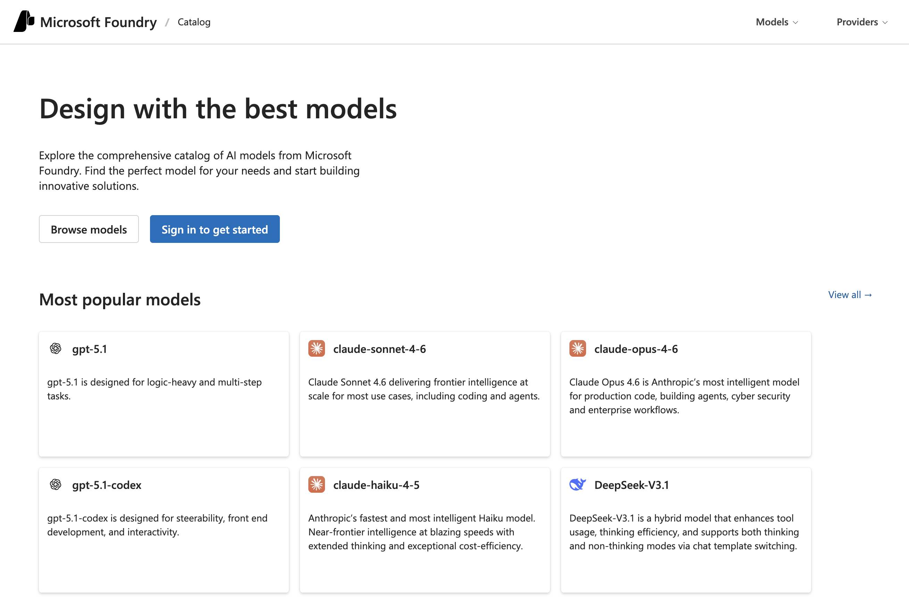


### 2.2 Sign In To Get Started

Click the blue **Sign In** button log in with your Azure subscription. You will see the _classic_ Foundry experience below (shown in dark mode) - but we'll switch to the _new_ Foundry UI experience, next.

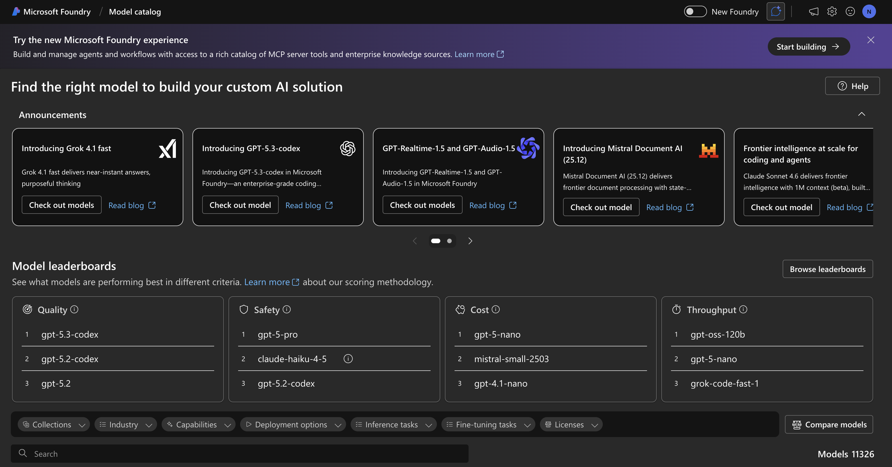

### 2.3 Activate New Foundry UI

Click the **Start Building** button to transition to the new Foundry experience. You should see a popup dialog as shown below - giving you the option to select an existing project or create a new one.

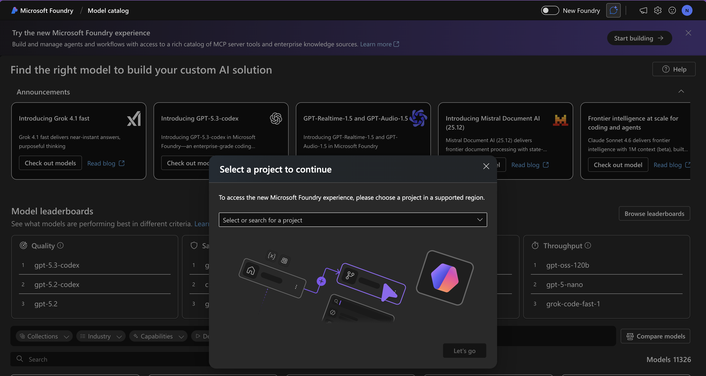

### 2.4 Create New Project

Click on the drop-down box - you should see the _Create a new project_ option. Click on that to trigger the workflow for project creation.

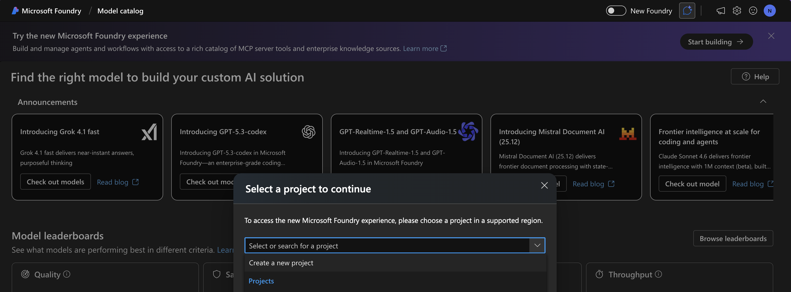

You should now see a dialog like this. 
- Pick a default project name (I used: `nitya-quest2-project`) 
- Switch region to `Sweden Central` (for fine-tuning, red-teaming)
- Keep other defaults (will map to your project name).

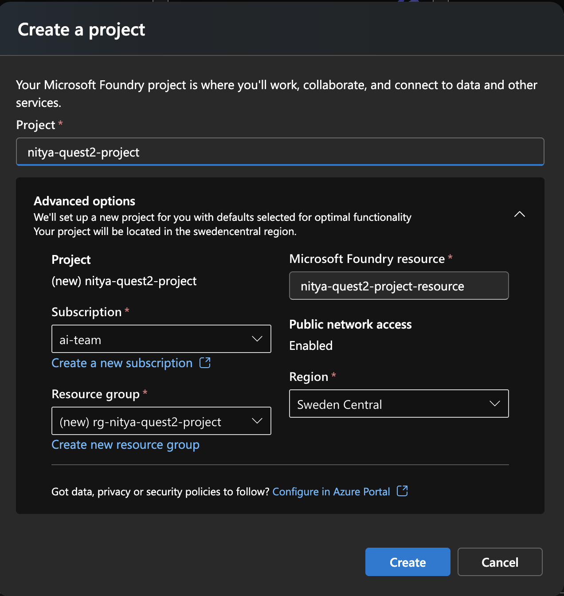

Click **Create** - setup should complete in a few minutes.

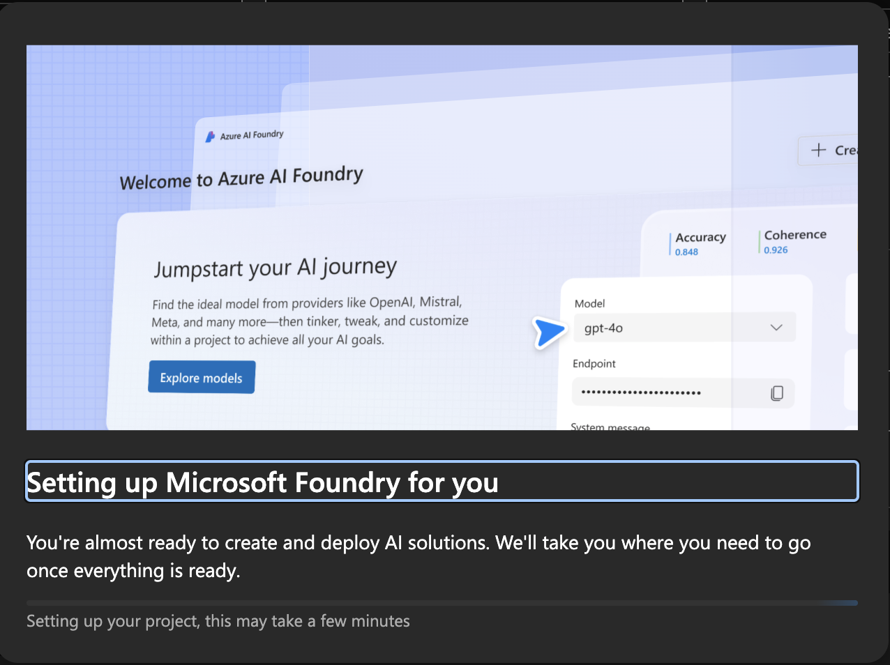

You should now see a page like this. _Note: Your UI may look slightly different - it is under active development. Just verify that you can see the project endpoint_. **Keep this page open in a browser tab!** We will revisit it periodically in our journey.

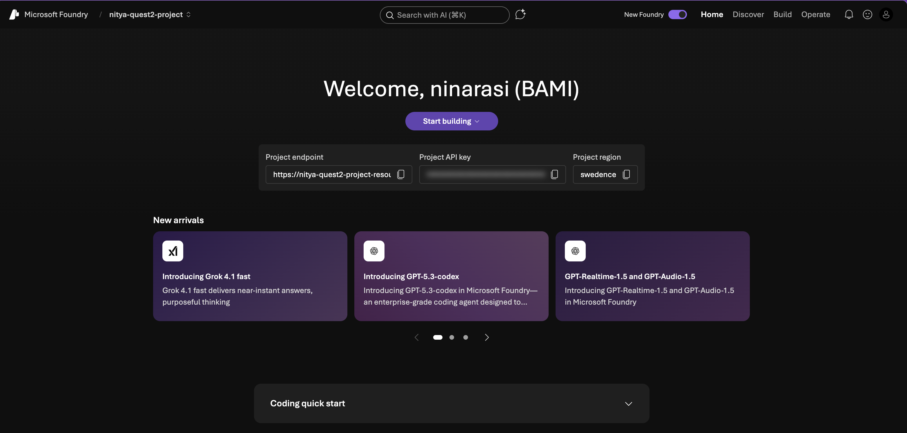

### 2.5 Add Application Insights

_We need to [connect Application Insights to our project](https://learn.microsoft.com/en-us/azure/foundry/observability/how-to/trace-agent-setup#connect-application-insights-to-your-foundry-project) to support tracing later. The new UI should support this feature soon - for now we will use a hack with the classic portal to get this done_.

Click the purple _New Foundry_ toggle (top right) - this switches you to the classic UI experience where you can now select the _Tracing_ tab on the sidebar as shown. Click the **Create new** option to create a new application insights resource.

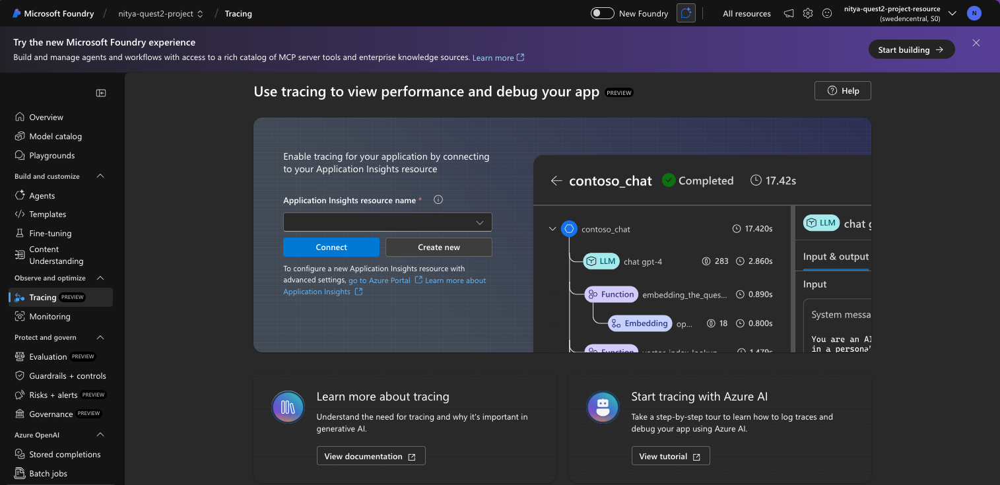

In the pop-up dialog, provide a meaningful name for your insights - and leave all other fields as defaults. Click **Create** to confirm.

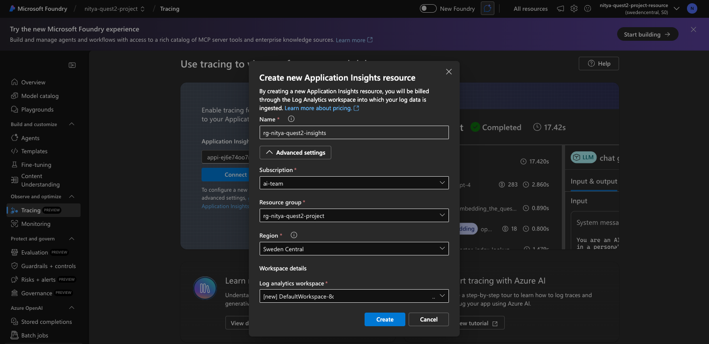

You should now see the Tracing tab show that the app insights resource is linked!

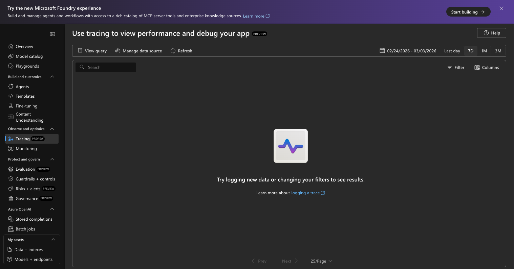

> 🌟 **SWITCH BACK TO NEW UI** - Don't forget to switch back to the new UI experience now, by sliding the _New Foundry_ toggle (top right) till it turns purple.

<br/>

## 3. Deploy Foundry Models

_We have a project, but now we need to deploy the brains of our Cora agent by selecting the right model for the job. In this step, you'll build your intuition for how to use the Foundry Models catalog and Leaderboard features - and then deploy two models that we need for this quest._

### 3.1 Discover Models

Microsoft Foundry has 11K+ model in its catalog, including [Direct from Azure](https://learn.microsoft.com/en-us/azure/foundry/foundry-models/concepts/models-sold-directly-by-azure?tabs=global-standard-aoai%2Cglobal-standard&pivots=azure-direct-others) options that are billed through your subscription and covered by Azure SLA. Using [standard deployment](https://learn.microsoft.com/en-us/azure/foundry/foundry-models/concepts/deployment-types#global-standard) gives you _pay-as-you-go_ pricing which is optimal for prototypes like this.

**But how do you pick the right model?**

1. Click the **Discover** tab (top right) in your new Foundry UI.

    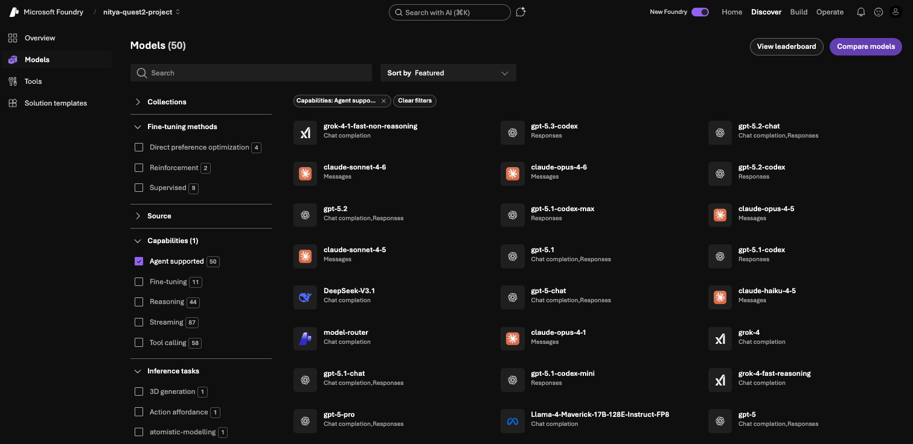

1. Now, click **View leaderboard** to see this view. [Model leaderboards](https://learn.microsoft.com/en-us/azure/foundry/concepts/model-benchmarks) help you compare models using _industry-standard benchmarks_ for quality, safety, throughput, cost and more. You can also **pick up to 3 models** to compare head-to-head in the table below.

    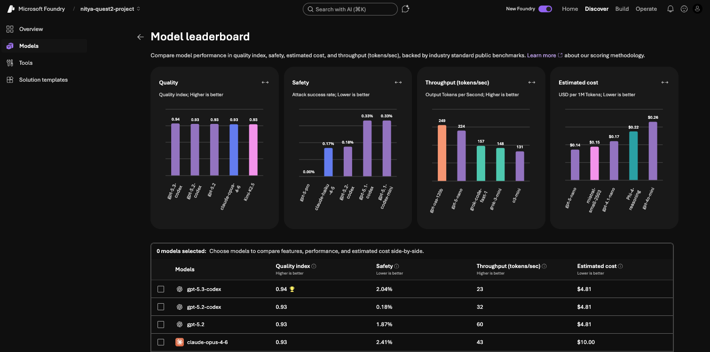

1. Let's pick `gpt-5.1`, `gpt-4.1` and `Llama-3.3-70B-Instruct` for now - and see how the comparison helps our selection process.

    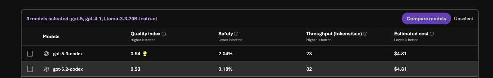

1. We can see that the `gpt-5.1` ranks best in quality and safety, the `gpt-4.1` is best in throughput, and the `Llama` model has the least cost. We can also see that `gpt-4.1` also supports fine-tuning - which is something we want to explore. **Decision: We will use gpt-4.1** to get started

    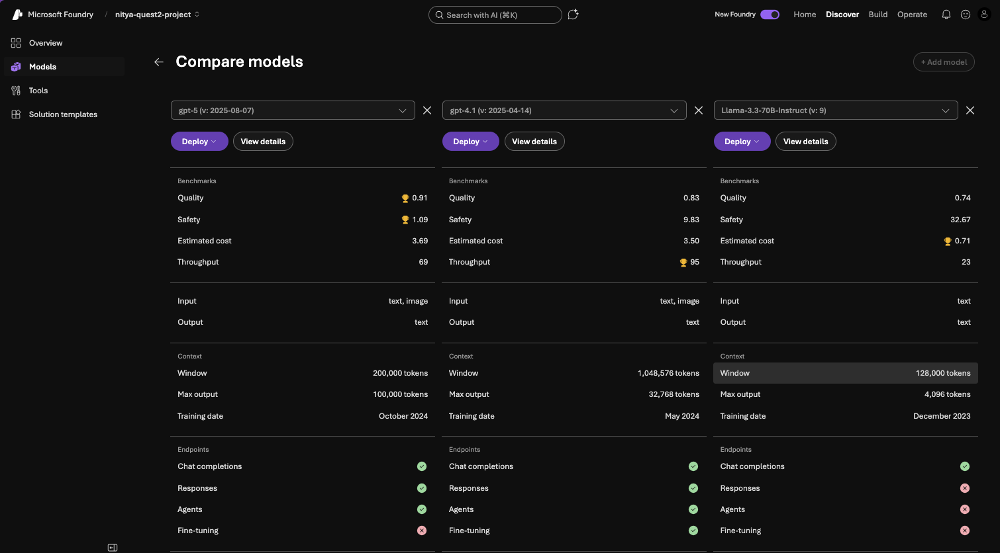

1. To deploy it, just click the purple button and use default settings with global standard for pay-as-you-go pricing.

    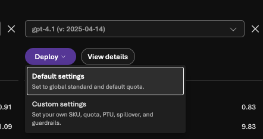

1. Your model is deployed! You can see the model playground and test it out interactively. Try asking "What paint should I use for my living room?" and see what you get.

    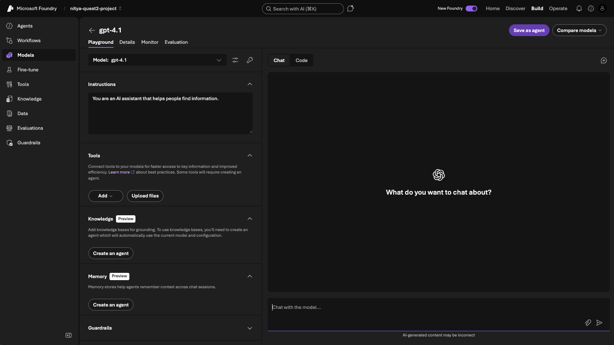

1. My response looks like this. Note the numbers below the response. This tells me the response took _3.6s+ (latency) and cost _369 tokens_ to process.
    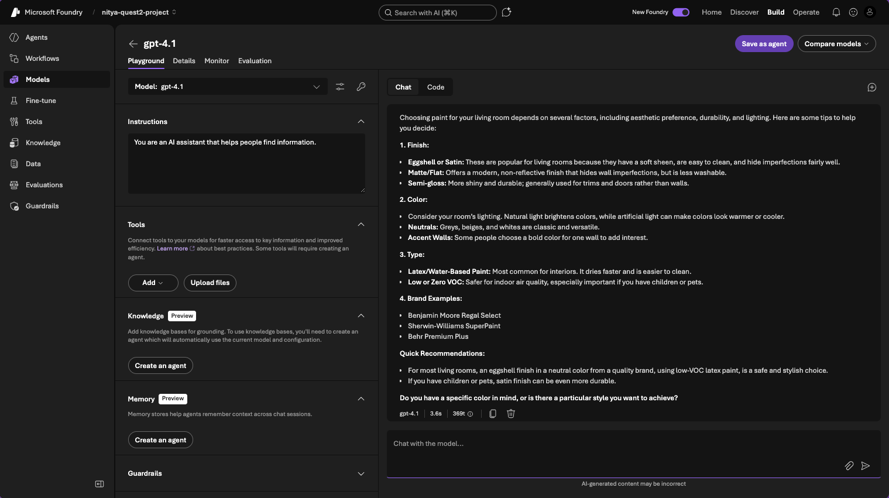

1. You can now click the back arrow to be taken to your _Models_ dashboard where you see the model is now listed.
    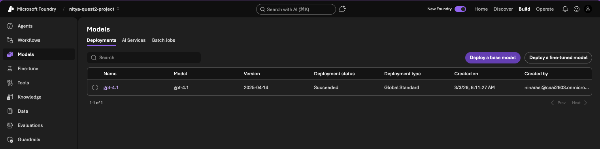

1. We can also deploy new models directly from this tab. For our fine-tuning experiment, we will need a smaller model - let's deploy `gpt-4.1-mini`. Just search for it by name.

    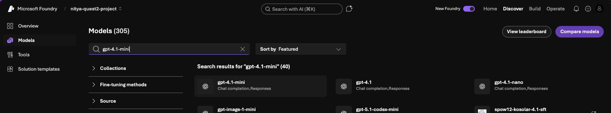

1. Then click the Deploy option in the model card page - choose the default again.
    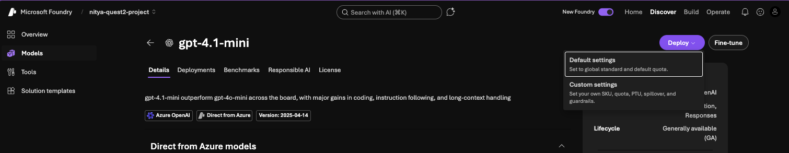

1. You now have both models deployed! You are ready to move to the code-first development workflow!
    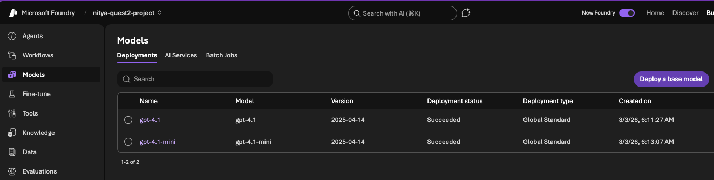

1. One final observation. What if you wanted to see the _trade-offs_ between models in terms of cost, quality etc.? You can return to the _Leaderboards_ page and scroll down to see the _Trade-off chart_. Select the models you are interested in - and see how they compare. In this case, I compared the `gpt-4.1` family of models - and we can see that `gpt-4.1-mini` is in the most attractive quadrant. _Later, we'll see how we can distill knowledge from gpt-4.1 to gpt-4.1-mini_ to optimize our agent costs.
    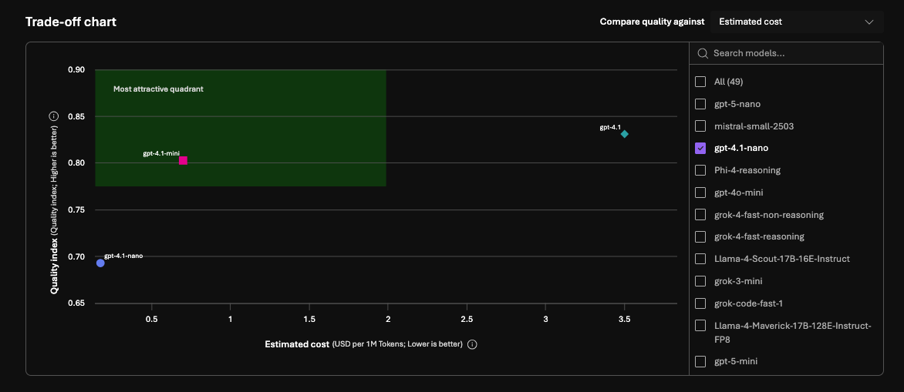


> 🎉 **CONGRATULATIONS**: Your Microsoft Foundry project is ready! Let's code!

<br/>

## 4. Start Your Quest!

_Return to your Codespaces tab in the browser. You should already be logged into Azure with `az login` but we need to configure our environment variables to use the new Foundry project - then run labs_.

### 4.1 Set Env Variables

The repository has a helper script that just does this for you. First, run this command from the terminal to make sure the script is executable.

```bash
chmod +x labs/scripts/setup-env.sh
```

Then run it:

```bash
./labs/scripts/setup-env.sh
```

You will be prompted to enter your previously created Foundry resource group name (see example)

```bash
Existing resource group name: rg-nitya-quest2-project
```

It should retrieve all necessary environment variables and set them up for you. If everything goes well, you will see this message:

```bash
━━━━━━━━━━━━━━━━━━━━━━━━━━━━━━━━━━━━━━━━━━━━━━━━━━━━━━━━━━━━━━━━━━━━
  🎉 Setup complete! You're ready to start the quest.

  Next steps:
    cd labs/js && npm run build && node dist/02-setup.js
━━━━━━━━━━━━━━━━━━━━━━━━━━━━━━━━━━━━━━━━━━━━━━━━━━━━━━━━━━━━━━━━━━━━
```

### 4.2 Build the labs (JavaScript)

Let's actually build _all_ the labs once, then we can just run each one separately. Use this command in yoyur terminal - this should create a `dist/` folder with executables for each task.

```bash
cd labs/js && npm run build
```

Now, just walk through each task below - run the executable for that step, inspect the code, and explore the outcomes in the Foundry portal or from the VS Code terminal window. 

Let's try it. The `02-setup.js` task simply checks that your environment variables are set correctly, and that the model deployment is working.

```bash
node dist/02-setup.js
```

You should see:

```

🔍 Checking environment variables…

  ✅ AZURE_AI_PROJECT_ENDPOINT
  ✅ MODEL_DEPLOYMENT_NAME

  ✅ MODEL_ENDPOINT
  ✅ MODEL_API_KEY
  ✅ TELEMETRY_CONNECTION_STRING
  ✅ AZURE_AI_PROJECTS_AZURE_SUBSCRIPTION_ID
  ✅ AZURE_AI_PROJECTS_AZURE_RESOURCE_GROUP
  ✅ AZURE_AI_PROJECTS_AZURE_AOAI_ACCOUNT

🔐 Connecting to Microsoft Foundry…
   Endpoint: https://nitya-quest2-project-resource.services.ai.azure.com/api/projects/nitya-quest2-project

🚀 Testing model deployment: gpt-4.1…
   Model response: "Hello from Foundry!"

✅ Foundry project is reachable and responding.
🎉 Setup verified — you're ready for Quest 2!
```

### 4.3 Ready? Let's Go!

Work through these tasks in order:

- [ ] [Task 1: Understand Foundry capabilities](./docs/01-overview.md)
- [ ] [Task 2: Setting up a Foundry project](./docs/02-setup.md)
- [ ] [Task 3: Selecting a base model](./docs/03-selection.md)
- [ ] [Task 4: Customizing the base model](./docs/04-customization.md)
- [ ] [Task 5: Designing the AI Agent](./docs/05-agent.md)
- [ ] [Task 6: Evaluating the agent responses](./docs/06-evaluation.md)
- [ ] [Task 7: Tracing the agent execution](./docs/07-tracing.md)
- [ ] [Task 8: Running a Red-Teaming scan](./docs/08-red-teaming.md)
- [ ] [Task 9: Teardown and cleanup](./docs/09-teardown.md)
