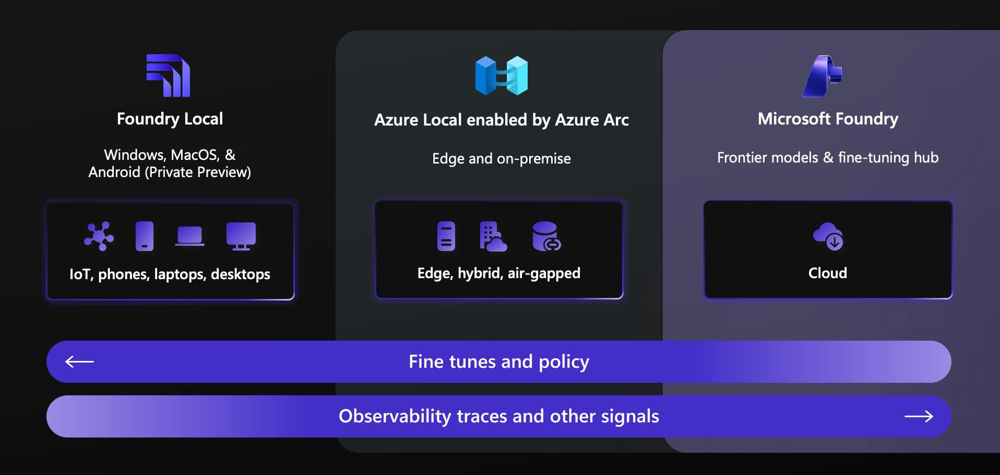
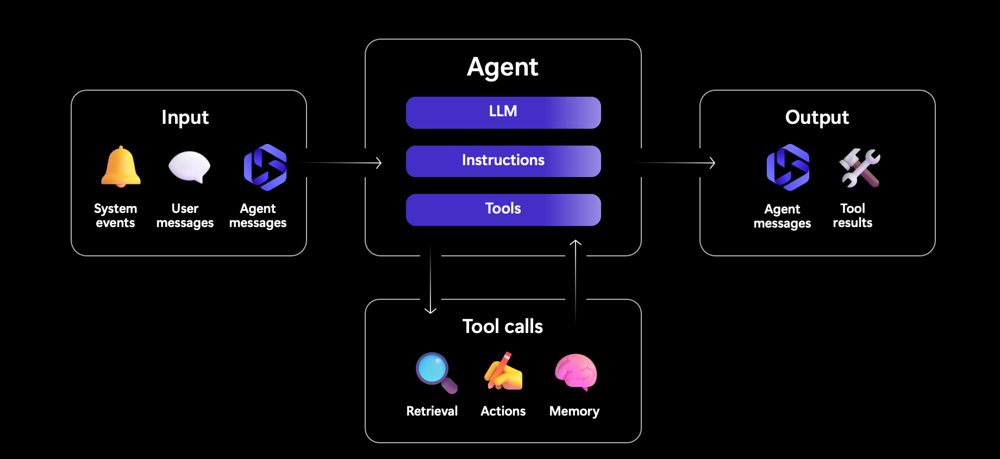
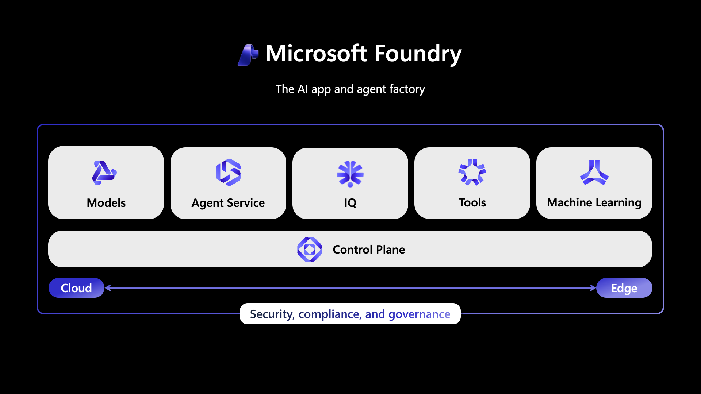
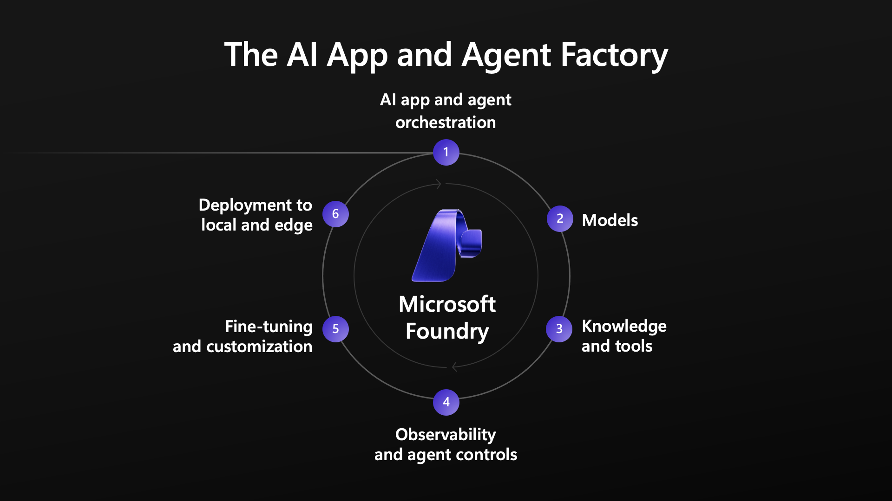
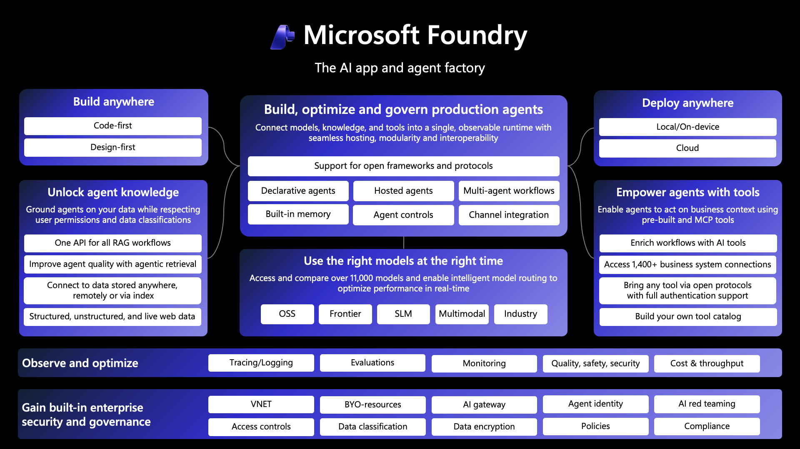
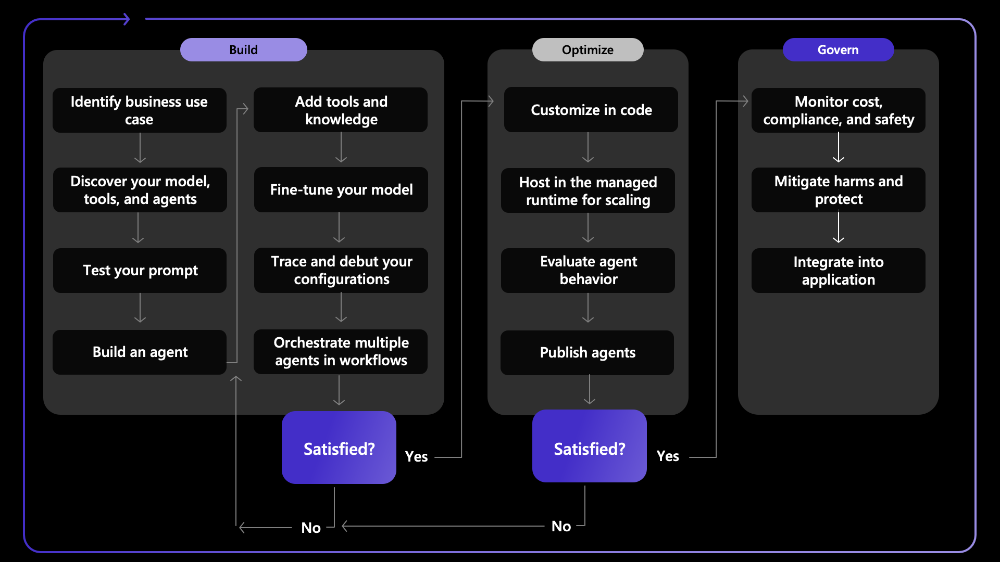
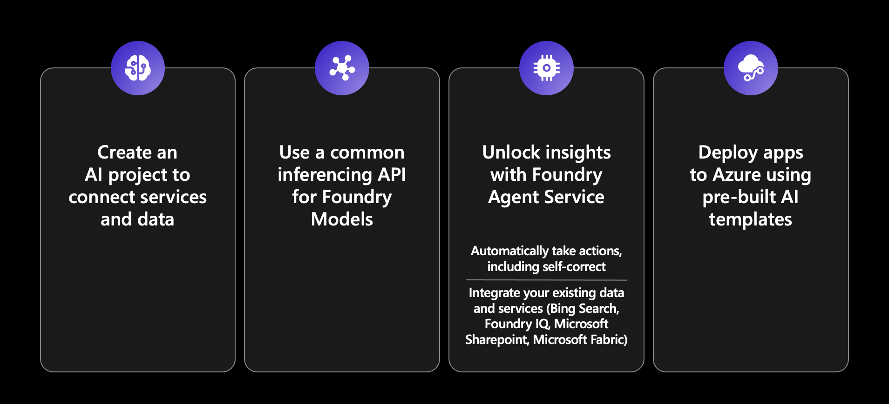
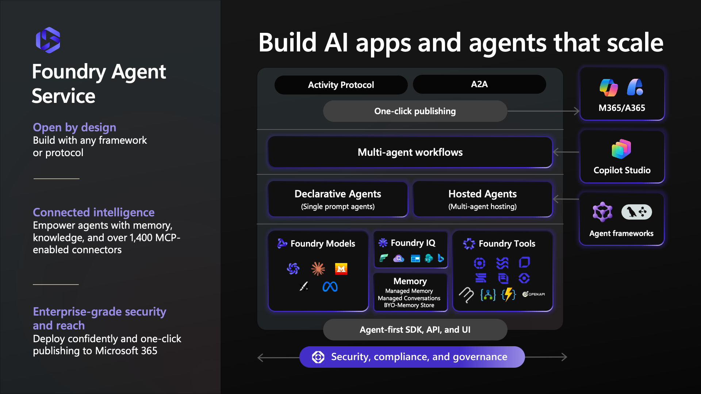
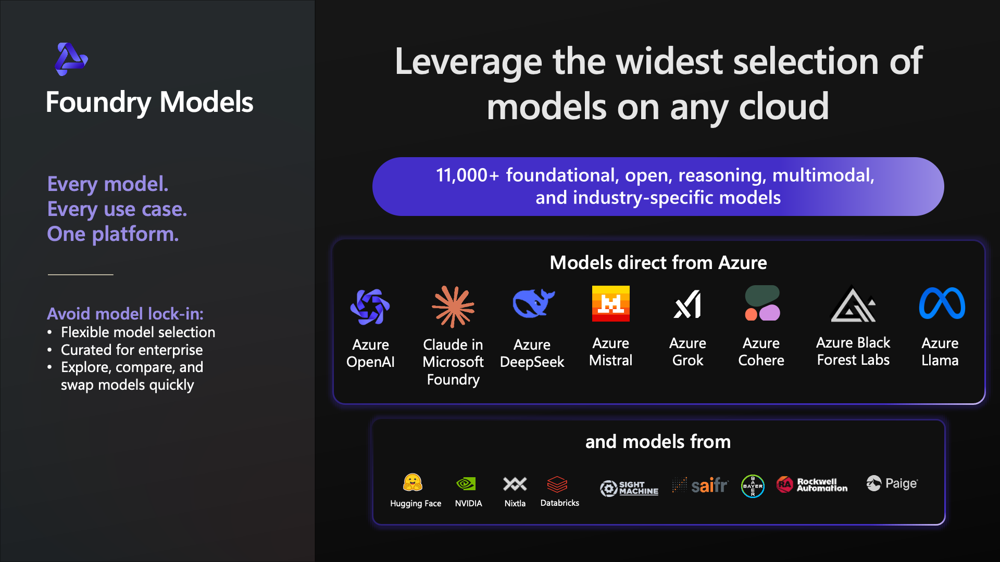
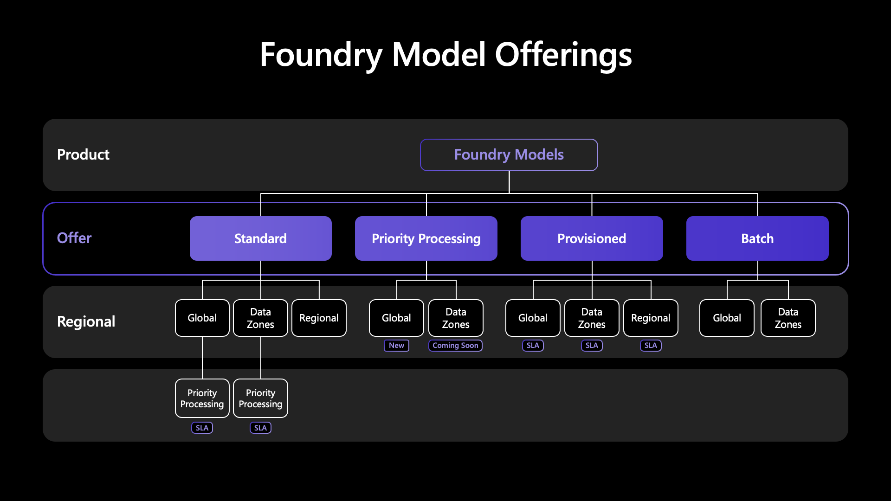

# 1. Hello, Microsoft Foundry!

In the previous Quest, you learned about the power of Foundry Local to do _on-device_ inference on capable local hardware, allowing you to build and deploy intelligent applications for use in desktop and mobile environments.

In this Quest, we'll look at the other end of the spectrum and learn about the power of the Microsoft Foundry platform for _cloud-scale_ enterprise-grade AI solutions that can take advantage of Frontier models and model customization with fine-tuning.

## 1.1 From Local to Cloud

Microsoft's AI platform spans three deployment targets — from lightweight on-device inference with **Foundry Local** (IoT, phones, laptops), through edge and on-premise deployments with **Azure Local**, to full cloud-scale capabilities with **Microsoft Foundry**. 

What ties them together is a unified platform where fine-tuned models and safety policies move _down_ from the cloud to the edge, while observability traces and telemetry flow _back up_ for monitoring. In this Quest, we'll work on the right side of this diagram — building Cora in the cloud using Foundry's frontier models, then evaluating and tracing it's behavior before deploying it to production.

 

## 1.2 What is an Agent?

Let's think about "Cora" as our AI agent example. When a shopper asks _"What paint should I use for my living room?"_, we don't want Cora to just guess the answer, or respond to the customer in a way that may be impolite or useless.

Instead, we need Cora to _analyze_ the question (and understand customer intent), then _retrieve_ the relevant information and _present_ it to them in a way that helps them take meaningful actions. The diagram shows the high-level view of an AI Agent, illustrating how it achieves this:

1. Inputs (user messages, session history, system context) flow into the Agent as inputs.
1. Agents are powered by models (LLM) that understand natural language and specialize in task execution _using provided instructions and context_.
3. Tools allow agents to _extend model capabilities_ to take additional actions before producing outputs. Agents can make "tool calls" for retrieval (searching the product catalog), actions (checking stock), and memory (recalling past conversations). 
4. Outputs (agent messages, tool results) provide artifacts you can display to the user, or use (via traces) for debugging or analyzing performance.

In Tasks 4 and 5, you'll implement exactly this pattern for Cora using the Foundry Agent Service.

 

## 1.3 The AI App and Agent Factory

That was just a single agent. In reality, our enterprise-grade solutions will be built by orchestrating multiple agents - some that we build, and others that we interact with in a given task context. Building these _agent fleets_ requires an agent factory - with an assembly line (workflow) that can take use from planning to production. Microsoft Foundry is designed to be the AI apps and agents factory.

It brings together five core capabilities under a unified control plane: 
- **Models** - with access to 11,000+ models (Frontier and Open-Source)
- **Agent Service** - with hosted agent runtime (abstracts complexity)
- **Foundry IQ** - for knowledge retrieval and grounding (from diverse sources)
- **Foundry Tools** - with 1,400+ connectors and integrations (to MCP servers)
- **Machine Learning** - with fine-tuning and training (for model customization)

 The platform spans cloud and edge deployments, with enterprise security, compliance, and governance built in. Throughout this Quest, you'll use several of these capabilities — starting with Models in Task 3, building an Agent in Task 5, and evaluating it in Task 6.

 

## 1.4 The App Dev Lifecycle

Building an AI agent isn't a one-shot process — it's an iterative cycle of planning, building, evaluating, and refining. Microsoft Foundry is organized to support the six stages of this developer workflow:

1. AI app and agent orchestration
1. Selecting the right models
1. Grounding them with knowledge and tools
1. Using Observability and agent controls 
1. Fine-tuning and customization
1. Deployment to local and edge. 

Our Quest follows this arc: you'll orchestrate Cora (Tasks 4–5), select and deploy a model (Task 3), add tools and knowledge (Tasks 4–5), instrument with tracing (Task 7), fine-tune for cost optimization (Task 4c), and understand the path to production deployment (Task 9).

 

## 1.5 The Foundry Platform Stack

Under the hood, the Microsoft Foundry platform provides a rich set of capablities as shown in this detailed view. Knowing all the pieces is not critical right now - but it helps to understand the "big boxes" so you can connect them to the end-to-end journey. 

At the center, you have "**build, optimize, and govern production agents**" — connecting models, knowledge, and tools into a single observable runtime. On the left, **Unlock agent knowledge** shows how you ground agents on enterprise data using RAG workflows. On the right, **Empower agents with tools** highlights 1,400+ MCP-enabled connectors. The bottom layers — **Observe and optimize** (tracing, evaluations, monitoring) and **Enterprise security and governance** (VNET, access controls, red teaming) — are exactly what you'll explore hands-on in Tasks 6, 7, and 8.

 

## 1.6 Build → Optimize → Govern

Now that you know the various pieces, let's understand the steps of the developer journey (AI Ops) and map it to our tasks:

- In the **Build** phase (Tasks 2–5), you'll identify the business use case (Zava DIY customer support), discover and deploy a model (gpt-4.1), test your prompt, build an agent, add tools and knowledge, and even fine-tune a smaller model. 
- In the **Optimize** phase (Tasks 6–7), you'll evaluate Cora's behavior with built-in evaluators, trace requests with OpenTelemetry, and iterate until you're satisfied. 
- In the **Govern** phase (Task 8), you'll run automated red-teaming to probe for safety vulnerabilities. Notice the feedback loops — if evaluation results aren't satisfactory, you go back and improve - reflecting real-world development practices.

 

## 1.7 SDK-Streamlined Development

The Microsoft Foundry platform supports design-first (start with Portal) and code-first (start with SDK) options so you can _build anywhere_. Let's look at the code-first journey.

1. First, **create an AI project** to connect services and data. 
1. Second, **use a common inferencing API**. 
1. _Third, **unlock insights with Foundry Agent Service**. 
1. Fourth, **deploy apps to Azure** using pre-built AI templates. 

We'll map to a subset of these in our Quest under the `labs/src` folder.

 

## 1.8 The Foundry API

The Foundry API is the unified surface that your code talks to, to use the various Foundry Platform components. You access it through various clients - for example: the Foundry Portal (UI), the Foundry SDK (code), or VS Code (extension).

Below that, the API exposes **capabilities**: Models, Agents, Datasets, Indexes, Evaluation, Tracing, Connections, and Fine-Tuning. These sit on a shared service layer with Azure and OpenAI Extensions. The code snippet on the right shows the pattern you'll use throughout this Quest: create an `AIProjectClient`, then call sub-clients like `client.deployments.list()` or `client.agents.createVersion()`

 

## 1.9 Foundry Agent Service

The Foundry Agent Service is where Cora comes to life. 

- It's **open by design** — use any framework or protocol (Activity Protocol, A2A). 
- It provides **connected intelligence**, empowering agents with memory, knowledge, and over 1,400 MCP-enabled connectors.
- It delivers **enterprise-grade security** with one-click publishing to Microsoft 365. 

Under the hood, the service supports both **Declarative Agents** (single-prompt agents) and **Hosted Agents** (multi-agent hosting), backed by Foundry Models, Foundry IQ (knowledge + memory), and Foundry Tools. 

In Task 5, you'll create a hosted agent with custom function tools — the same architecture shown in the center of this diagram.

 

## 1.10 Foundry Models

But all your AI developer journeys always begin with model choice. Foundry Models gives you the widest selection of models on any cloud — over 11,000 foundational, open, reasoning, multimodal, and industry-specific models. Leverage cutting-edge **Frontier** models, or explore open-source variants and domain-specific specialized models from partners.

- Models [_direct from Azure_](https://learn.microsoft.com/en-us/azure/ai-foundry/foundry-models/concepts/models-sold-directly-by-azure?view=foundry) - including Azure OpenAI, DeepSeek, Mistral, xAI, Cohere, Black Forest Labs, Meta and Moonshot AI models - are covered by Azure SLA and billed through your Azure subscription.
- Models [_from partners and community_](https://learn.microsoft.com/en-us/azure/ai-foundry/foundry-models/concepts/models-from-partners?view=foundry) - including Anthropic, Stability AI, Hugging Face and more - are accessible through the marketplace and follow partner-specific guidance for deployments. 

Once deployed, the models are accessible through the same inference API. In Task 3, you'll deploy **gpt-4.1** as Cora's primary model, and in Task 4c you'll fine-tune **gpt-4.1-mini** as a cost-optimized alternative — demonstrating how Foundry makes it easy to explore, compare, and swap models.

**Understanding Model Deployments**

When you deploy a model in Foundry, you choose an **offer type** that determines pricing, throughput, and availability. 
- **Standard** deployments (Global, Data Zones, Regional) are pay-as-you-go and ideal for development — this is what you'll use in Task 3. 
- **Priority Processing** provides higher throughput guarantees
- **Provisioned** deployments offer reserved capacity with SLA guarantees for production workloads. 
- **Batch** deployments are optimized for large offline processing jobs. 

For this Quest, Global Standard is the best choice — it gets you started quickly with no capacity commitment, and you can upgrade later as Cora moves toward production.

---

**Next → [Task 2: Setting Up a Foundry Project](./02-setup.md)**
