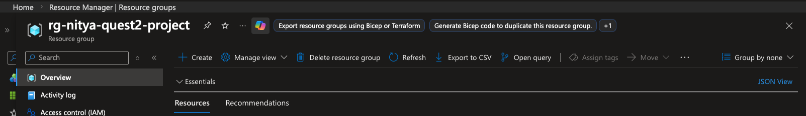

# 9. Tear It Down

You've completed the full developer journey! Before you go, let's clean up the Azure resources created during this quest to avoid unnecessary charges. _You should also shutdown and delete the Codespaces session, to ensure your quota is not depleted_.

## Learning Objectives

- Identify all resources created during the quest.
- Clean up the Azure resources
- Clean up and Codespaces environment

## What Was Created

During this quest, you created a Foundry project, deployed models, fine-tuned a model, and ran evaluation and red-teaming scans. Now it's time to clean up resources to avoid unanticipated charges beyond this quest.

## Clean Up Azure Resources

Follow the [Microsoft Portal guidance](https://learn.microsoft.com/en-us/azure/foundry/tutorials/quickstart-create-foundry-resources?tabs=azurecli#clean-up-resources) to delete all resources associated with this project using one of these options.

1. **Use the Azure CLI**

    ```bash
    az group delete --name <your-project-name> --yes --no-wait
    ```

2. **Use the Foundry Portal**

    1. Visit [https://portal.azure.com](https://portal.azure.com) and login with your Azure subscription.
    1. Click on the **Resource Groups** option on the landing page 
    1. Locate the resource group you created - and click to visit it. 
    1. Look for the *Delete resource group** option - see below
    1. Click and confirm - the deletion should take a few minutes.

    


## Clean Up Codespaces

_Note: If you used the option that forked the repo before starting a Codespaces, you may want to take a minute to save your changes to your fork first._.

1. If you are currently in the codespace, click the green button (bottom left with "Codespaces:" name) - and the **Stop Current Codespace**. _Note the name used here_.
1. Then go to [your GitHub Codespaces](https://github.com/codespaces) setting in a new tab. This will list all the codespaces (active and stopped) in your account.
1. Find the codespace name from step 1 - click the three dots at the end - and select **Delete** from the dropdown menu.

_Note that this deletes the Codespace completely and releases all resources._.

## Checkpoint

✅ Verify cleanup:

- [ ] Visit the [Azure Portal](https://ai.azure.com) - ensure the resource group is deleted
- [ ] Visit the [Foundry Portal](https://ai.azure.com) - your project should no longer be listed
- [ ] Visit the [GitHub Codespaces](https://github.com/codespaces) - your codespace should not be listed

## 🎉 Congratulations!

You've completed Quest 2 — the end-to-end developer journey with Microsoft Foundry!

### What You Accomplished

1. **Model Selection** — Chose gpt-4.1 from the catalog using benchmarks.
2. **Model Customization** — Engineered prompts, grounded in product data, fine-tuned to gpt-4.1-mini.
3. **Agent Design** — Built Cora with function tools and conversation management.
4. **Evaluation** — Measured quality and safety with built-in evaluators.
5. **Tracing** — Instrumented execution with OpenTelemetry.
6. **Red-Teaming** — Tested against adversarial attacks.

### Next Steps

Now, think about how to apply these skills to your own projects:

1. **Write a custom evaluator** — What metrics matter for your use case?
2. **Extend Cora's tools** — Add inventory management, order tracking, or return policies.
3. **Fine-tune with your data** — Use real customer conversations for better distillation.
4. **Deploy to production** — Add content filtering, rate limiting, and monitoring.

---

**[← Task 8: Red-Teaming](./08-red-teaming.md)** | **← Back to [README](../README.md)**